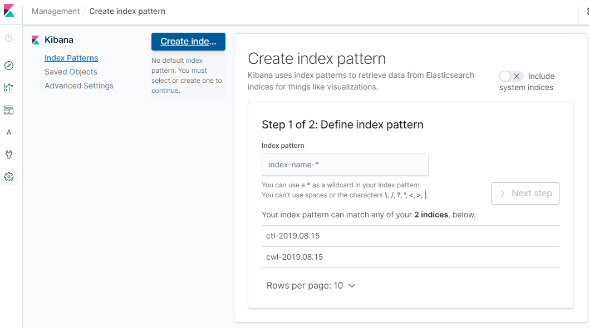
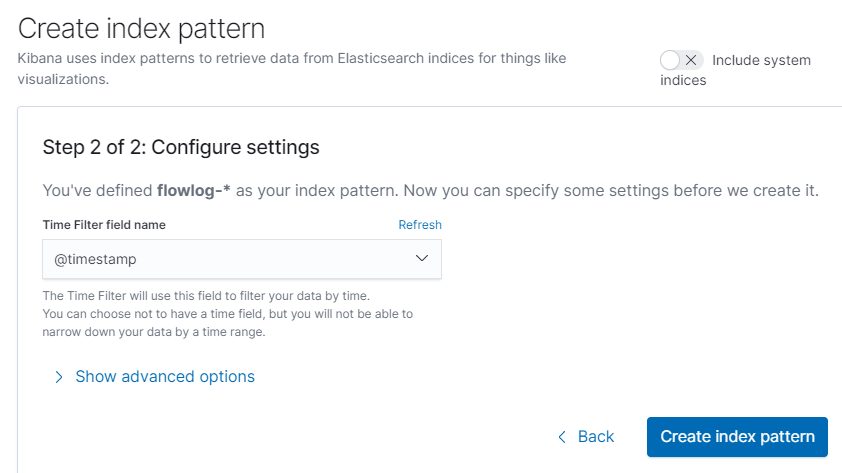

# 監査ログ検索ハンズオン


## 1. 監査ログCloudTrail をAthenaで検索


### 1.1 CloudTrail設定
CloudTrail > 証跡情報

##### 証跡の作成　をクリック


##### 証跡名に　`cloudtrail-handson` 　を入力


##### ストレージの場所で新しいバケットを作成しますか　 `はい`
S3バケット　`cloudtrail-handson-<アカウントID>`　を入れて作成をクリック


##### 証跡情報に作成した証跡のS3バケットが表示されることを確認


### 1.2 テーブルの作成
 CloudTrail > イベント履歴

##### 「Amazon Athena で高度なクエリを実行します」　をクリック 


##### 「Amazon Athenaでのテーブルを作成」ダイアログが表示され、
保存場所に `cloudtrail-handson-<アカウントID>` を選択し、テーブル作成をクリック


##### 「・・・作成されました」が表示されたら、キャンセルをクリック


### 1.3 Athenaで検索
最初のアクセスでは　Get Startedをクリック


##### Database に `default` を選択、Tablesに `cloudtra_logs_ cloudtrail_handson-<アカウントID>`があることを確認


#### イベント別件数の集計
FROMに `cloudtra_logs_ cloudtrail_handson-<アカウントID>`　を指定し、
検索条件に今日の日付を含むように BETWEEN句を修正する。
```
SELECT
 date(from_iso8601_timestamp(eventtime)) as date,
 count(*) as count,
 eventsource,
 eventtype,
 eventname,
 awsregion,
 sourceipaddress
FROM
  cloudtrail_logs_cloudtrail_handson_925889618331
WHERE
  awsregion = 'ap-northeast-1'
  AND date_format(from_iso8601_timestamp(eventtime),'%Y/%m/%d %H:%i')
  BETWEEN '2019/08/01 00:00'
      AND '2019/08/19 00:00'
GROUP BY
  date(from_iso8601_timestamp(eventtime)),
  eventsource,
  eventtype,
  eventname,
  awsregion,
  sourceipaddress
ORDER BY
 date(from_iso8601_timestamp(eventtime)) DESC
```
##### Run queryを実行


##### 実行結果


####  詳細一覧のクエリ
同様に
FROMに `cloudtra_logs_ cloudtrail_handson-<アカウントID>`　を指定し、
検索条件に今日の日付を含むように BETWEEN句を修正する。
```
SELECT
 date_format(from_iso8601_timestamp(eventtime),'%Y/%m/%d %H:%i') AS datetime,
 eventsource,
 eventtype,
 eventname,
 awsregion,
 sourceipaddress,
 vpcendpointid,
 errorcode,
 useridentity,
 resources,
 serviceeventdetails
FROM
  cloudtrail_logs_cloudtrail_handson_925889618331
WHERE
  awsregion = 'ap-northeast-1'
  AND date_format(from_iso8601_timestamp(eventtime),'%Y/%m/%d %H:%i')
  BETWEEN '2019/08/01 00:00'
      AND '2019/08/19 00:00'
ORDER BY datetime DESC
```

##### 実行結果


####参考
[CloudTrail レコードの内容](https://docs.aws.amazon.com/ja_jp/awscloudtrail/latest/userguide/cloudtrail-event-reference-record-contents.html)

##### eventsource 一覧

| サービス名 | イベントソース |
|:---------------|---------------------|
|ログインなど |	signin.amazonaws.com||CloudFormation |	
|S3 |	s3.amazonaws.com|
|RDS |	rds.amazonaws.com|
|EC2 |	ec2.amazonaws.com|
|IAM |	iam.amazonaws.com|
|Lambda |	lambda.amazonaws.com|
|Redshift |	redshift.amazonaws.com|
|Quicksig |	quicksight.amazonaws.com|
|SNS |	sns.amazonaws.com|
|STS |	sts.amazonaws.com|
|SQS |	sqs.amazonaws.com|
|CloudTrail |	cloudtrail.amazonaws.com|
|CloudWatch |	monitoring.amazonaws.com|
|CloudWatchLogs |	log.amazonaws.com|
|DynamoDB |	dynamodb.amazonaws.com|


## 2. Redshift 監査ログ
###  2.1 監査ログ設定

##### Redshift > クラスター
クラスターを選択し、データベースをクリック


##### 監査ログ記録の設定をクリック


* 監査ログ記録の有効化　`はい`
* S3バケット　新規作成を選択
* 新規バケット名　`redshift-audit-<アカウントID>`
* S3キープレフィックス `dwhaudit`　を入力して保存


### 2.2 Amazon S3を確認
S3のバケットができたことを確認


### 2.3 Redshiftにアクセスしてログを残す
Redshift > クラスター


##### エンドポイント名をコピー
5439  はポート番号になるので `:` の前までがホスト名


[DbVisualizeを導入 https://www.dbvis.com/](https://www.dbvis.com/)

##### DbVisualizerを起動
Database Server に　エンドポイントのホスト名をペースト
Database Port に `5439`
Database user id `awsuser`
Database Password  `指定されたパスワード` 
を入力して、Connect


##### 接続が成功したら、クエリーを実行
```
SELECT
  prod_id,
  count(1) as deal_count,
  avg(quantity_sold) as average_sold_num,
  sum(quantity_sold*amount_sold) as total_sales
FROM
  sh10.sales
GROUP BY
  prod_id
ORDER BY
  total_sales DESC;
```


##### ディスク容量の確認クエリ
```
SELECT
  trim(pgdb.datname) AS Database,
  trim(pgn.nspname) AS Schema,
  trim(a.name) AS Table,
  b.mbytes,
  a.rows
FROM (
  SELECT db_id, id, name, sum(rows) AS rows
  FROM stv_tbl_perm a
  GROUP BY db_id, id, name
) AS a
JOIN pg_class AS pgc on pgc.oid = a.id
JOIN pg_namespace AS pgn on pgn.oid = pgc.relnamespace
JOIN pg_database AS pgdb on pgdb.oid = a.db_id
JOIN (
  SELECT tbl, count(*) AS mbytes
  FROM stv_blocklist
  GROUP BY tbl
) b on a.id = b.tbl;
```


### 2.4 Athenaで検索

##### データベースの作成
```
CREATE  DATABASE auditlogdb
```
Athenaで create database を実行


##### 外部テーブルの作成
`<アカウントID>` にご自身のアカウントIDを入れる
* userlog
```
CREATE external TABLE auditlogdb.userlog
(
userid INTEGER,
username CHAR(50),
oldusername CHAR(50),
action CHAR(10),
usecreatedb INTEGER,
usesuper INTEGER,
usecatupd INTEGER,
valuntil TIMESTAMP,
pid INTEGER,
xid BIGINT,
recordtime VARCHAR(200)
)
PARTITIONED by(
year char(4),
month char(2),
day char(2)
)
row format delimited
lines terminated by '\n'
stored as textfile
location 's3://redshift-audit-<アカウントID>/dwhaudit/AWSLogs/<アカウントID>/redshift/ap-northeast-1';
```
* connection ログ
```
CREATE external TABLE auditlogdb.connectionlog
(
event CHAR(50) ,
recordtime VARCHAR(200) ,
remotehost CHAR(32) ,
remoteport CHAR(32) ,
pid INTEGER ,
dbname CHAR(50) ,
username CHAR(50) ,
authmethod CHAR(32) ,
duration BIGINT ,
sslversion CHAR(50) ,
sslcipher CHAR(128) ,
mtu INTEGER ,
sslcompression CHAR(64) ,
sslexpansion CHAR(64) ,
iamauthguid CHAR(36)
)
PARTITIONED by(
year char(4),
month char(2),
day char(2)
)
row format delimited
fields terminated by '|'
stored as textfile
location 's3://redshift-audit-<アカウントID>/dwhaudit/AWSLogs/<アカウントID>/redshift/ap-northeast-1';
```


* activity ログ
```
CREATE external TABLE auditlogdb.activitylog
(
logtext VARCHAR(20000)
)
PARTITIONED by(
year char(4),
month char(2),
day char(2)
)
row format delimited
lines terminated by '\n'
stored as textfile
location 's3://redshift-audit-<アカウントID>/dwhaudit/AWSLogs/<アカウントID>/redshift/ap-northeast-1';
```

#### S3の YYYY/MM/DD に分割されたデータをパーティションとして登録
S3にはデータが YYYY/MM/DD に分割されている。これをパーティションとして登録しないと検索されない。
```
ALTER TABLE auditlogdb.connectionlog ADD PARTITION (year='2019',month='08',day='14') location 's3://redshift-audit-<アカウントID>/dwhaudit/AWSLogs/<アカウントID>/redshift/ap-northeast-1/2019/08/14/';


ALTER TABLE auditlogdb.activitylog ADD PARTITION (year='2019',month='08',day='14') location 's3://redshift-audit-<アカウントID>/dwhaudit/AWSLogs/<アカウントID>/redshift/ap-northeast-1/2019/08/14/';

ALTER TABLE auditlogdb.userlog ADD PARTITION (year='2019',month='08',day='14') location 's3://redshift-audit-<アカウントID>/dwhaudit/AWSLogs/<アカウントID>/redshift/ap-northeast-1/2019/08/14/';
```


#### 検索の実行
例
```
SELECT * FROM "auditlogdb"."connectionlog" limit 10;
```


## 3. CloudTrail ログをElasticsearchで検索


### 3.1 CloudTrail 証跡を CloudWatch Logsへ配信する
CloudTrail > 証跡情報　
##### CloudWatch Logsの設定を押す
 

##### 新規または既存のロググループに　`CloudTrail/AuditLogGroup` を入力して次へ


##### 許可を押す


##### 次へ


##### 成功するとロググループが設定される


### 3.2 CloudWatch Logsの確認
CloudWatch > ログ　


##### CloudTrail/AuditLogGroup をクリックし
ログストリームが出来ていることを確認する


### 3.3 Elasticsearch Service の構成

##### 自分のIPアドレスをメモしておく
[使用中のIPアドレスを調べる http://www.cman.jp/network/support/go_access.cgi](http://www.cman.jp/network/support/go_access.cgi)

##### Elasticsearch Service を選択


##### 新しいドメインの作成


##### 開発およびテストを選択
バージョンは最新を選択して次へ


* ドメイン名`handson`
* インスタンスタイプ　`r5.large.elasticsearch`  
次へ


##### `パブリックアクセス` を選択し、


##### テンプレートを選択から `特定のIPからのドメインアクセスを許可`　を選択


##### メモしてある自分のIPアドレスを登録


##### 次へ


##### 確認をクリック


##### ドメインが作成され、`読み込み中`となります。


##### `アクティブ` になったら　Kibanraをクリック


##### KibanaにアクセスできればOK
`Explore on my own` をクリック


##### Kibanaの管理画面が表示される


### 3.4 CloudWatch LogsからLamndaの構成
CloudWatch > ログ　
`CloudTrail/AuditLogGroup` を選択


##### アクションから　Amazon Elasticsearch Serviceへのストリーム　をクリック


##### Amazon ES クラスター `handson` を指定


##### Lambda IAM  実行ロール　`新しいIAMロールの作成`を選択


##### IAMロールの作成で、許可　をクリック


##### 次へ


##### ログの形式　で　`AWS CloudTrail` を選択


##### 次へ


##### 次へ


##### ストリーミングの開始


##### サブスクリプションフィルターが作成される


### 3.5 Lambdaの確認
Lambda ＞関数
関数をクリック


##### `LogsToElasticsearch_handson`が表示される


##### 関数コードを開き


63行目　`cwl-` 　が Elasticsearchのindex pattern になるため、書き変える


`cwl-` を `ctl-`  に書き変える
```
        // index name format: ctl-YYYY.MM.DD
        var indexName = [
            'ctl-' + timestamp.getUTCFullYear(),              // year
            ('0' + (timestamp.getUTCMonth() + 1)).slice(-2),  // month
            ('0' + timestamp.getUTCDate()).slice(-2)          // day
        ].join('.');
```

##### 保存する


##### また、ここのコードをコピーして、メモ帳に保存しておく

### 3.6 KibanaでIndexを作成する
##### Kibana  > 左端メニューの ` Management` をクリック


##### Index Patterns >  Create index


##### Index patternに　`ctl-` を入力し、Next Step


##### Time Filter field name に `@timestamp` を選択し Create index pattern


##### フィールドが表示されればOK


##### Kibana  > 左端メニューの ` Discover` をクリック
`ctl-*` のIndexが表示されることを確認する


##### 再び　Kibana  > 左端メニューの `Management` をクリック


##### Saved Objects を選択し、import をクリック


##### Import saved objects　にファイル
`cloudtrail-kibana-dashboard.json` を指定して、import


##### New index に `ctl` を選択して　Confirm all changes 


##### Done をクリック


##### Main-Dashboard および　複数のVisualizeがインポートされる


##### Kibana  > 左端メニューの `Dashboard` をクリック


##### Dashboardが表示される


##### filter 条件を ✕ で削除


##### Dashboardに表示される
Indexを作成した直後のため、まだログがなく、フィルターを外さないとほとんど出て来ないため、フィルター条件を外している


## 4. Flowlogを Elasticsearchで検索

### 4.1 Flowlogの作成
VPC > VPCを選択 > アクション > フローログの作成


##### 送信先ロググループ　`/aws/flowlog` 


##### 権限の設定をクリック


* IAMロール　`新しいIAMロールの作成` 
* ロール名  `HandonFlowlogsRole`
* を入力し、許可


##### IAMロール名  `HandonFlowlogsRole` を選択し、作成


##### 作成されたら　閉じるをクリック


### 4.2  CLoudWatchLogからElasticsarchに配信するLambdaの作成

 Lambda > 関数 > 関数の作成


##### 一から作成を選択
 

* 関数名 `FlowLogsToElasticsearch_handson`
* ランタイム　`Node.js 8.10` 
* 実行ロール　`既存のロールを使用する`
* 既存のロール　`lambda_elasticsearch_execution`
を設定し、関数の作成


##### トリガーを追加をクリック


##### トリガーの設定に `CloudWatch Logs`を選択


##### 追加をクリック
* ロググループ　`/aws/flowlog`
* フィルターの名前 `flowlogES`
* フィルターパターン `[version, account_id, interface_id, srcaddr != "-", dstaddr != "-", srcport != "-", dstport != "-", protocol, packets, bytes, start, end, action, log_status]`


##### CloudWatch LogsのトリガーができればOK


##### FlowLogsToElasticsearch_handsonを選択し、開発コードを表示


##### 前章でメモ帳に保存したLogsToElasticsearch_handson の関数コードをここの開発コードにペーストする
63行目を `flowlog-` に書き変えて保存する


### 4.3  CloudWath log の確認
CloudWatch > ログ
サブスクリプションが設定されていることを確認する


### 4.4 Kibana
Kibana > Management ＞　Index patterns > Create index pattern
Index pattern に `flowlog-`を入れて　Next Step


##### Time Filter field name　に `@timestamp` を選択し、Create index patternを押す


##### dashboardのimport
Management  > Saved Objects > Import


##### flow-dashboard.json をimport


##### import成功したら　done


##### Dashboard　>  FlowDashboard


##### 以上、dashboardを自由にカスタマイズしてください。
